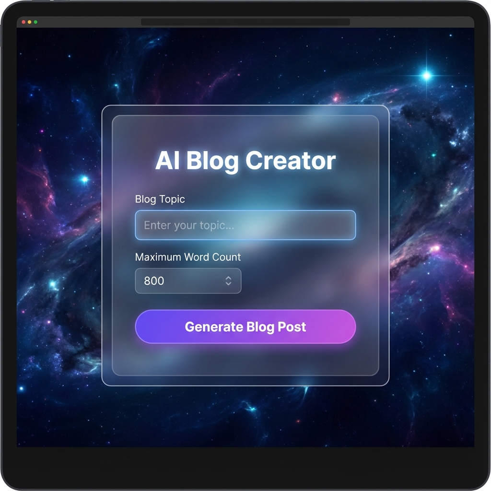

# Blog Creator

An AI-powered technical blog post generator using Spring AI, Ollama, and a modern Glassmorphism UI.



## Overview
This application allows users to generate high-quality technical blog posts by simply providing a topic and a desired word count. It uses a local LLM (llama3.2 via Ollama) to generate content.

## Features
- **AI-Powered**: Generates relevant and coherent technical content.
- **Modern UI**: specialized Glassmorphism design with responsive animations.
- **Customizable**: Set your desired topic and maximum word length.
- **Local Privacy**: Runs entirely locally using Ollama.

## Tech Stack
- **Backend**: Spring Boot 3.3.0, Spring AI
- **LLM**: Ollama (llama3.2)
- **Frontend**: HTML5, Vanilla CSS3 (Glassmorphism), JavaScript (No frameworks)
- **Build**: Maven

## Prerequisites
1. **Java 17+** installed.
2. **Ollama** installed and running.
   - Pull the model: `ollama pull llama3.2`

## Getting Started

1. **Clone the repository**
   ```bash
   git clone <repository-url>
   cd blog-creator
   ```

2. **Ensure Ollama is running**
   ```bash
   ollama serve
   ```

3. **Run the Application**
   ```bash
   mvn spring-boot:run
   ```

4. **Access the UI**
   Open your browser and navigate to: [http://localhost:8081](http://localhost:8081)

## API Usage

You can also use the API directly:

### Generate Blog
**endpoint**: `GET /creator/create`

**Parameters**:
- `topic`: The subject of the blog post.
- `size`: The maximum number of words.

**Example**:
```bash
curl "http://localhost:8081/creator/create?topic=Spring+Boot&size=300"
```

## Configuration
Customize the application in `src/main/resources/application.properties`:
```properties
server.port=8081
spring.ai.ollama.chat.options.model=llama3.2
```

## License
MIT License
